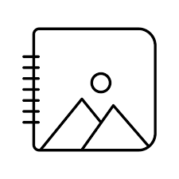

<!-- PROJECT LOGO -->
 

  

  <h3 align="center">Album App</h3>

  

    A dummy application which is fetching album data from dummy api and showing to FE using React.
     
    <a href="https://github.com/akg07/album-app#readme"><strong>Explore the docs »</strong></a>
     
     
    <a href="https://github.com/akg07/album-app#readme">View Demo</a>
    ·
    <a href="https://github.com/akg07/album-app/issues">Report Bug</a>
    ·
    <a href="https://github.com/akg07/album-app/issues">Request Feature</a>
  

### Live Demo
Click on link https://album-app-akg.netlify.app/

### Sample Images
Here are some sample images of the project. Have a quick look

#### Home page 
![home Page Screen Shot][home-screenshot]

(<a href="#readme-top">back to top</a>)

<!-- CONTACT -->
## Contact
In Case of any issue related to project setup or anything please contact me on ayush3032@gmail.com 

Aayush Kumar Gupta - [@Aayushkg_07](https://twitter.com/Aayushkg_07) - ayush3032@gmail.com

Project Link: [https://github.com/akg07/album-app](https://github.com/akg07/album-app)

(<a href="#readme-top">back to top</a>)

<!-- ACKNOWLEDGMENTS -->
## Acknowledgments

* [Open Source License](https://choosealicense.com)
* [Coding Ninjas](https://www.codingninjas.com/)
* [Geeks for Geeks](https://www.geeksforgeeks.org/)
* [Font Awesome](https://fontawesome.com)

(<a href="#readme-top">back to top</a>)

[home-screenshot]: /src/assets/images/home.png
